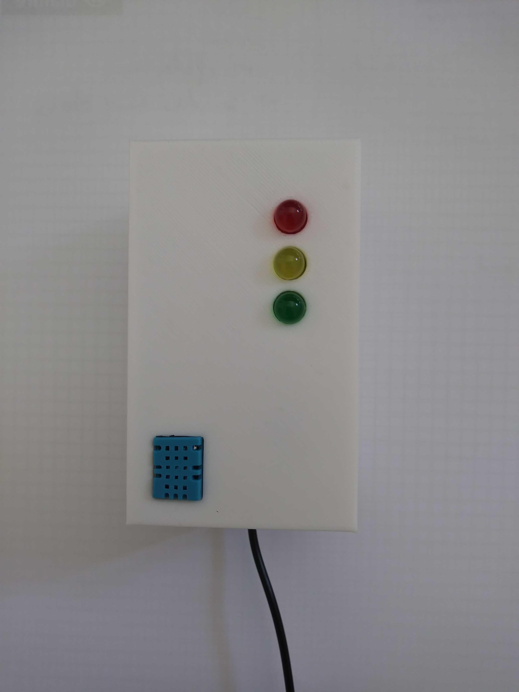
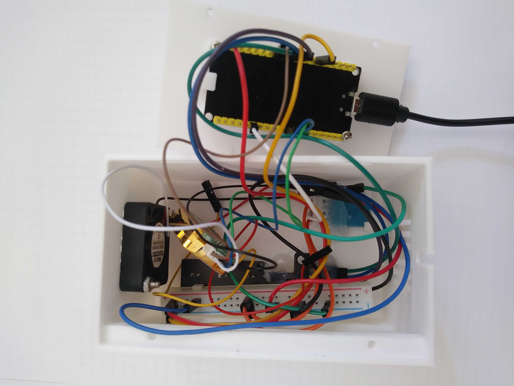
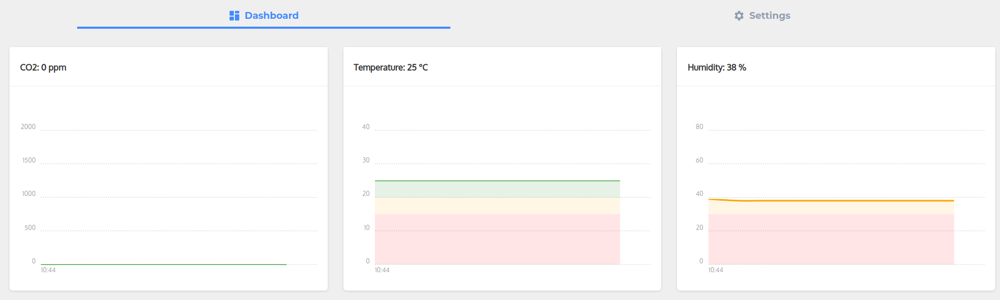
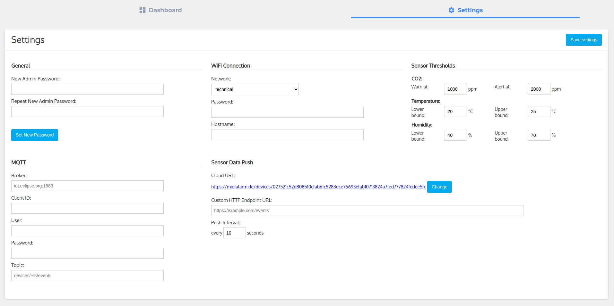
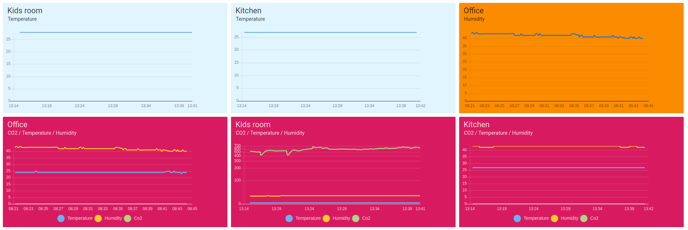

# A CO₂ / Temperature / Humidity Sensor for ESP32 and ESP8622 Platforms

## Overview

The sensor can be used to measure the CO2 content, temperature and humidity inside closed rooms.
The measured data can be read directly from the sensor via the integrated web interface.
Alternatively, the measured values can be sent to any web server or cloud provider via MQTT or HTTP.

### Required hardware components

To build the device, the following components are required:

- [ESP32 or ESP8622 board with integrated WiFi antenna](https://www.espressif.com/en/products/devkits)
- [MH-Z19 CO2 sensor](https://esphome.io/components/sensor/mhz19.html)
- [DHT11 temperature and humidity sensor](https://www.az-delivery.de/en/products/5-x-dht11-temperatursensor)
- [Mini traffic light](https://www.az-delivery.de/en/products/led-ampel-modul)
- [Pack of jumper wires](https://www.az-delivery.de/en/products/mini-breadboard)
- [Mini breadboard](https://www.az-delivery.de/en/products/mini-breadboard)
- [Raspberry Pi cooling fan (optional)](https://www.az-delivery.de/en/products/aktiver-mini-kuhlventilator)

### Wiring and Casing

### Firmware

The firmware is based on [Mongoose OS](https://mongoose-os.com/mos.html) and can be used freely.
See [Mongoose OS C/C++ quickstart](https://mongoose-os.com/docs/mongoose-os/quickstart/develop-in-c.md) for the C/C++ development introduction.
Once the firmware has been installed, the device acts as an access point to which you can connect via smartphone, for example.

### 3rd party libraries used for this project

- [Mongoose OS](https://github.com/cesanta/mongoose-os)
- [Micro-ECC](https://github.com/kmackay/micro-ecc)
- [Protothreads](https://github.com/markose/Protothreads)
- [Chartist](https://github.com/gionkunz/chartist-js)
### User interface

Once you are connected to the network, you can access the device's web interface via a browser.
All you have to do is enter the IP address of the device in the browser bar.
The settings are secured using Digest Authentication. The default credentials are admin:admin.

### Miefalarm cloud

The device is connected to a cloud application by default.
As soon as a WiFi connection to a network with Internet access is established, the device sends the sensor data to the cloud URL.
By clicking on the corresponding link in the settings, you can access the device configuration of the cloud application.
Through this interface it is possible to group different devices.
Based on this, complex dashboards can be configured.
For example, the air quality of different rooms in a building can be clearly displayed on one dashboard.

