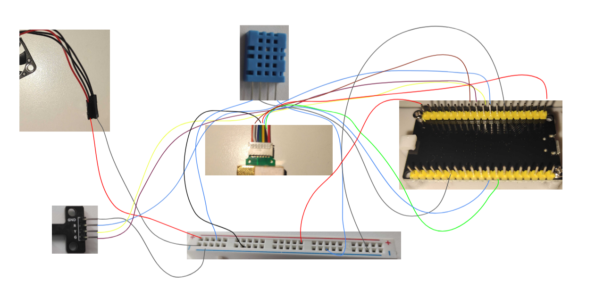

# A CO₂ / Temperature / Humidity Sensor for ESP32 and ESP8622 Platforms

## Overview

The sensor can be used to measure the CO2 content, temperature and humidity inside closed rooms.
The measured data can be read directly from the sensor via the integrated web interface.
Alternatively, the measured values can be sent to any web server or cloud provider via MQTT or HTTP.

### Required hardware components

To build the device, the following components are required:

- [ESP32 or ESP8622 board with integrated WiFi antenna](https://www.espressif.com/en/products/devkits)
- [MH-Z19 CO2 sensor](https://esphome.io/components/sensor/mhz19.html)
- [DHT11 temperature and humidity sensor](https://www.az-delivery.de/en/products/5-x-dht11-temperatursensor)
- [Mini traffic light](https://www.az-delivery.de/en/products/led-ampel-modul)
- [Pack of jumper wires](https://www.az-delivery.de/en/products/mini-breadboard)
- [Mini breadboard](https://www.az-delivery.de/en/products/mini-breadboard)
- [Raspberry Pi cooling fan (optional)](https://www.az-delivery.de/en/products/aktiver-mini-kuhlventilator)

### Firmware

The firmware is based on [Mongoose OS](https://mongoose-os.com/mos.html) and can be used freely.
See [Mongoose OS C/C++ quickstart](https://mongoose-os.com/docs/mongoose-os/quickstart/develop-in-c.md) for the C/C++ development introduction.

### Build and installation

```bash
mos build && mos flash
```

### 3rd party libraries used for this project

- [Mongoose OS](https://github.com/cesanta/mongoose-os)
- [Micro-ECC](https://github.com/kmackay/micro-ecc)
- [Protothreads](https://github.com/markose/Protothreads)
- [Chartist](https://github.com/gionkunz/chartist-js)
### Wiring and casing

Wiring is as follows, but can of course be customized according to your needs.

- PIN_DHT 21
- PIN_MHZ19C_HD 33
- PIN_LED_RED 27
- PIN_LED_YELLOW 26
- PIN_LED_GREEN 25
- PIN_BUTTON_CALIBRATE 0
- UART_NO 2

The case was printed with a 3D printer.
There are ventilation slots at the top and bottom.
Additionally, a Raspi fan was integrated for active ventilation.




### User interface

After the firmware has been installed, the device acts as an access point to which you can connect via smartphone, for example.

Mongoose OS starts a WiFi network called `Mongoose_XXXXXX` with password `Mongoose`.
Switch your smartphone to that WiFi network.

Once you are connected to the network, you can access the device's web interface via a browser.
Point your favorite web browser to http://192.168.4.1
You should then see the user interface of the device. 

The settings are secured using [Digest access authentication](https://en.wikipedia.org/wiki/Digest_access_authentication).
The default credentials are `admin:admin`.

Select a WiFi network and enter the password.
In addition, you can assign a host name for the device so that you can better identify it in your network.


### Miefalarm cloud

The device is connected to a cloud application by default.
As soon as a WiFi connection to a network with Internet access is established, the device sends the sensor data to the cloud URL.
By clicking on the corresponding link in the settings, you can access the device configuration of the cloud application.

By using this interface it is possible to group different devices and build complex dashboards.
For example, the air quality of different rooms in a building can be clearly displayed on one dashboard.

